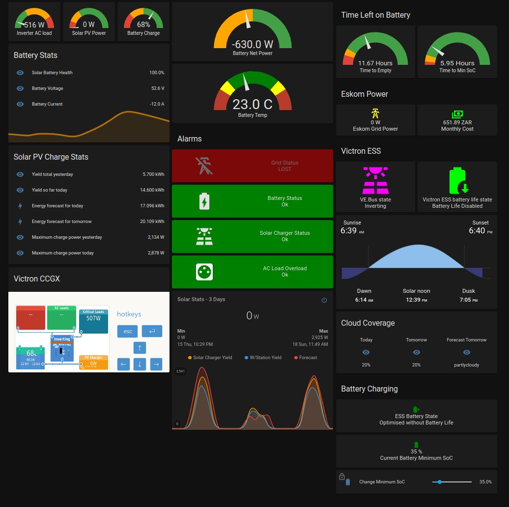
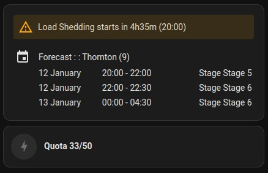
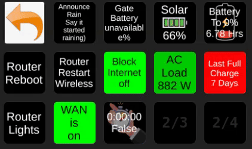

# GadgeteerZA Home Assistant
A repository of the YAML files used to configure my Home Assistant instance. My instance is hosted in a Docker container on an Intel NUC inside the home.

## Screenshots

## Description
These are the YAML config files from my own installation of Home Assistant. Every installation is unique, and built up from others' ideas and code, and mine will likely be expanding and updating over time. So I will share what I've been learning on my journey, in the hope it helps other new users. I've battled up to three or four hours sometimes to just get one card working properly, and it often comes down to syntax or formatting issues.

A key focus is on the Modbus TCP interface with a Victron solar system, and a Balancell battery. This instance of HA is running in a Docker container (docker-compose.yaml also included).

This is not a 'how-to' guide (nor intended to be config files to copy straight into your own HA hence no releases here), but intended more as a reference for others to learn from the syntax and formatting of the code, or for accessing Victron or Balancell battery Modbus address registers.

I have expanded some information about the Modbus registers inside the modbus.yaml config file (and in my video). But if things break with regards to Victron Modbus readings, it is always best to start troubleshooting at the source, by running the mbpoll command from your computer terminal to see what data is returned from a Modbus register eg. to read register 840 (battery voltage) from slave device 100 (main Multiplus system) you'd run it as `mbpoll -a 100 -r 841 -c 1 192.168.1.205` where you'll see we add +1 for the register number being probed, and the 192.168.1.205 is my Victron CCGX's LAN IP address (you'd use your device's IP address).

You can watch my video at https://www.youtube.com/watch?v=dlvlhou70VA about my initial setup of the dashboards.

NOTE: There is now a Victron GX module available in HA under HACS since 2024 so you can also consider using that instead of my Modbus configs - see https://github.com/sfstar/hass-victron.

The video clip above of the Elgato Stream Deck is an example of how you can further display your HA data to other devices. This was done on Linux using the Bitfocus Companion app.

## Key features and Integrations
The following are some notable features that this particular installation uses:
* Modbus TCP interface to a Victron CCGX with a Multiplus II inverter/charger, and Victron SmartSolar charger
* Balancell battery stats read - https://balancell.com/products/balancell-p26-solar/ (not all are readable unfortunately)
* Time left on battery to Empty (My Victron is set to cut-off at 11% SOC so I have empty as 11% SOC) as well as to the current Minimum SoC (based on current battery load in Amps as it changes in real-time). Changed sensors.yaml to just work on AC Load wattage instead of switching back and forth between charge and discharge. It now estimates time to go based on current load, whether charging or discharging, for consistency.
* Batteries need to be fully charged at least weekly to prevent cell imbalance, so there is automation to set a timer when the battery reaches full charge, and then warn if 7 days has passed since that time, with a dashboard gauge showing the day count (see detail in discussion at https://github.com/Danie10/gadgeteerza-homeassistant/discussions/6).
* Gauges tuned for severity colours
* Ellies Efergy Engage hub energy monitoring of grid power used at DB - https://engage.efergy.com/
* Tasmota firmware on Sonoff POW2 WiFi switch via MQTT showing power usage stats, and switch control
* Glances performance stats from one local server, and a remote VPS server
* Reolink WiFi IP cameras
* Android Phone status, location, battery level, etc
* Ambient weather station data
* Weather Underground Personal Weather Station stats
* City of Cape Town load shedding via EskomSePush API showing also time to start of next load shedding for our area
* Ring doorbell including last video captured and low battery warning
* Google Cast for voice output alert notifications
* Asus router for alerting VoIP phone left network (battery is flat)
* UptimeRobot to monitor key websites
* AdGuard Home for performance of DNS
* Google Calendar showing next few days' schedule
* RSS feed showing Netflix titles leaving soon (removed widget as no longer using Netflix, but could also be a news feed)
* Mini graph showing actual solar charger yield compared to weather station's actual measured radiation in W/m2, and adjusted for panel area and wattage. Also includes forecasted solar for the day, and the following day.
* Restrictions (locks) set with warnings before some switches are toggled on the dashboard
* Dashboard switches to turn Tasmota switch on/off, and to adjust Victron ECC Minimum SOC level
* Home Assistant Community Store (HACS) integrations and frontend UI
* HA is running in a Docker container

## Automations
* Voice alerting to start of rain (to take washing off the line) - unfortunately weather station takes a few minutes to report
* Voice notification to home speaker for when I leave the shopping mall
* Slider to set battery minimum State of Charge back to Victron CCGX ESS ie. adjust Victron system
* Adjust minimum SoC slider to match any changes made on Victron CCGX side ie. respond to changes made on Victron system remotely
* Alerts when hot water cylinder reached temperature and is ready, based on timers looking at grid power usage dropping after 15 minutes of high usage
* VoIP phone battery flat by checking when it's 'last_activity' is longer than 10 minutes ago (is not working properly as it is checking presence of the phone's base station)
* Ham radio APRS beacon going offline (can't use left Zone as coordinates never change to elsewhere) so looks at a status change to 'Away' for longer than 31 minutes (still tweaking this)
* Some audio message alerts for Victron system alarms
* Voice alert warning when AC load on the inverter exceeds 4,9 kWh
* Voice alerts for when grid power has been lost, as well as when it is back on (it's a must in South Africa, and with a solar system you don't always know if the grid is back on, or when it has gone off)
* Voice alert for 30 minutes before scheduled load shedding for our zone starts (just some time to put shower hot water on)
* Critical alert when battery SOC gets down to 16%

## Files
* File in docker sub-folder is the docker-compose file I used to create the Home Assistant container
* Other config files are inside the ha-configs subfolder for HA. All are as named. The lovelace file is a copy of the Lovelace dashboard UI config to see how the UI cards are configured, especially those with text replacement for numerical value data (it is found inside /.storage/ on the server).

## ToDo Wishlist
* Try link for click on Glances card to open full Glances web page
* Automations for motion detected on cameras
* Automation to adjust battery minimum SoC based on next day's weather forecast
* Automation to fully charge battery if 7 days passed without a full charge
* Get Ambient weather card to show rain in mm instead of inches
* Integration with Geyserwise hot water cylinder heating - no comms so may need a Geyserwise Max IoT device instead
* Integration with Texecom burglar alarm system if possible
* Convert template sensors code format to newer format
* Possible time left to solar battery full charge gauge (problematic as 100% SOC is not full charge - see discussion at https://github.com/Danie10/gadgeteerza-homeassistant/discussions/5)

## Time Left on Battery Calculations
Just for interest this is how I've done the basic calculation, based on the Balancell battery pack having a 206 Ah max rated capacity at full ie. 100% SOC. Note cut-off for my battery is 11% SOC so the time to empty now reflects time down to 11% and no longer to 0%:
* Hours left = (SOC%-11%) multiplied by Max Rated Capacity and then divided by Battery Current draw in Amps (yes battery current varies but it recalculates on current usage)
  * ((74%-11%) * 206 Ah) / 13 Amps = 11.72 hours to battery cut-out
* Time left to Minimum SoC basically is the same except it subtracts the Min SOC from Current SOC to arrive at the difference left to reach Min SOC (Delta %), so if Minimum SOC is say 40% then:
  * ((74%-40%) * 206 Ah) / 13 Amps = 5.38 hours to Min SOC and grid takes over
  * Added condition for time to Min SOC to keep showing 0 hours if the SOC has already fallen below Min SOC
Detail is in the sensors.yaml file with comments.

## Credits
Some resources I learnt a lot from include:
* Video using Modbus-TCP at https://youtu.be/giosYremoss
* Modbus guide on Victron site at https://community.victronenergy.com/questions/78971/home-assistant-modbus-integration-tutorial.html and mentions automating SOC according to weather
* Another Modbus guide inc Unit ID's = https://www.reddit.com/r/homeassistant/comments/nzimbj/tutorial_how_to_integrate_a_victron_inverter_into/
* Modbus code with Victron Github code at https://github.com/lucode/home-assistant
* MQTT guide at https://www.imval.tech/index.php/blog/victron-mqtt-server-bridging
* Victron CCGX Modbus TCP FAQ at https://www.victronenergy.com/live/ccgx:modbustcp_faq
* How to set up Automations - https://youtu.be/2tRZ_WA8Xyc
* Instructions for container use of HAC - https://hacs.xyz/docs/setup/download
* HAC Custom button possibility at https://github.com/custom-cards/button-card
* RGB colour chart - https://www.rapidtables.com/web/color/RGB_Color.html
* Restriction card confirmation at https://smarthomepursuits.com/how-to-create-a-lovelace-restriction-card-in-home-assistant/
* Home Assistant docker image at https://www.home-assistant.io/installation/linux#docker-compose
* Load Shedding module integrates with EskomSePush - https://github.com/wernerhp/ha.integration.load_shedding
